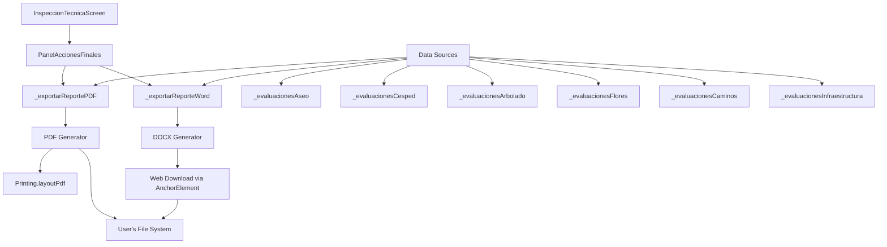
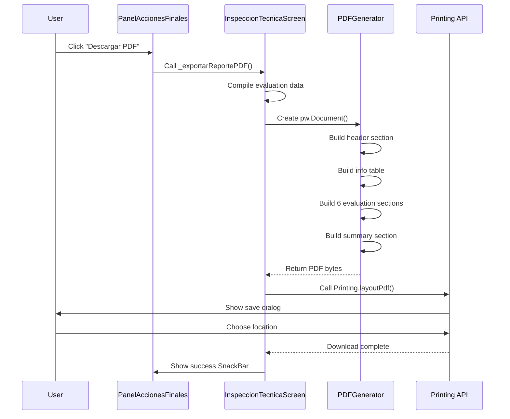
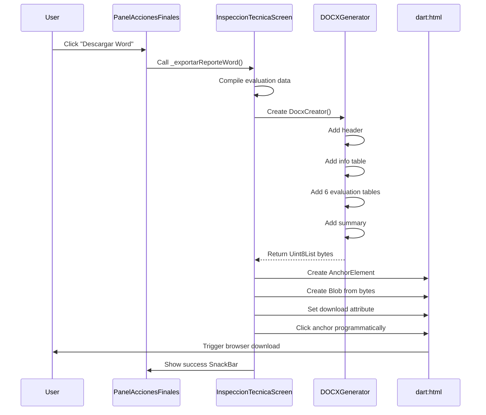

# Design Document: Export Inspection Reports

## Overview

Este feature implementa la funcionalidad de exportación de reportes de inspección técnica en dos formatos: PDF y Word (DOCX). El sistema debe recopilar todas las evaluaciones de las 6 pestañas de inspección (ASEO, CÉSPED, ARBOLADO, FLORES, CAMINOS, INFRAESTRUCTURA), generar documentos profesionales con formato tabular, y proporcionar mecanismos de descarga apropiados para una aplicación Flutter web.

El diseño se centra en dos funciones principales: `_exportarReportePDF()` y `_exportarReporteWord()`, que serán integradas en la pantalla existente `InspeccionTecnicaScreen`.

## Architecture



## Sequence Diagrams

### PDF Export Flow



### Word Export Flow



## Components and Interfaces

### Component 1: PDFExportService

**Purpose**: Generate a professional PDF document with all inspection data

**Interface**:
```dart
class PDFExportService {
  /// Generates a complete PDF inspection report
  Future<pw.Document> generateInspectionPDF({
    required String plazaId,
    required String nombrePlaza,
    required String correoSupervisor,
    required Map<String, Map<String, String?>> allEvaluations,
    required Map<String, List<String>> allCriteria,
    required String estadoGeneral,
  });
  
  /// Builds the header section
  pw.Widget _buildHeader(String nombrePlaza);
  
  /// Builds the info table
  pw.Widget _buildInfoTable(String plazaId, String nombrePlaza, String correo);
  
  /// Builds an evaluation section table
  pw.Widget _buildEvaluationSection(
    String sectionTitle,
    Map<String, String?> evaluations,
    List<String> criteria,
  );
}
```

**Responsibilities**:
- Generate PDF documents using the `pdf` package
- Format data into professional tables and sections
- Handle all 6 evaluation sections consistently
- Provide print preview and save functionality via Printing API

### Component 2: WordExportService

**Purpose**: Generate an editable Word document (.docx) with inspection data

**Interface**:
```dart
class WordExportService {
  /// Generates a complete DOCX inspection report
  Future<Uint8List> generateInspectionDOCX({
    required String plazaId,
    required String nombrePlaza,
    required String correoSupervisor,
    required Map<String, Map<String, String?>> allEvaluations,
    required Map<String, List<String>> allCriteria,
    required String estadoGeneral,
  });
  
  /// Adds header section to document
  void _addHeader(DocxCreator docx, String nombrePlaza);
  
  /// Adds info table to document
  void _addInfoTable(DocxCreator docx, String plazaId, String nombrePlaza, String correo);
  
  /// Adds an evaluation section table
  void _addEvaluationSection(
    DocxCreator docx,
    String sectionTitle,
    Map<String, String?> evaluations,
    List<String> criteria,
  );
}
```

**Responsibilities**:
- Generate DOCX documents using the `docx_creator` package
- Create editable tables that can be modified in Microsoft Word
- Structure data identically to PDF format for consistency

### Component 3: WebDownloadHelper

**Purpose**: Handle file downloads in Flutter web environment

**Interface**:
```dart
import 'dart:html' as html;

class WebDownloadHelper {
  /// Triggers a file download in the browser
  static void downloadFile({
    required Uint8List bytes,
    required String fileName,
    required String mimeType,
  });
}
```

**Responsibilities**:
- Create Blob objects from byte arrays
- Create anchor elements with download attributes
- Trigger programmatic downloads in web browsers
- Handle browser-specific download behavior

## Data Models

### Model 1: InspectionData

```dart
class InspectionData {
  final String plazaId;
  final String nombrePlaza;
  final String correoSupervisor;
  final DateTime fechaHora;
  final String estadoGeneral;
  final Map<String, EvaluationSection> sections;
  
  InspectionData({
    required this.plazaId,
    required this.nombrePlaza,
    required this.correoSupervisor,
    required this.fechaHora,
    required this.estadoGeneral,
    required this.sections,
  });
}
```

**Validation Rules**:
- plazaId must be non-empty
- nombrePlaza must be non-empty
- correoSupervisor should be a valid email format (optional)
- fechaHora must be a valid DateTime
- sections must contain exactly 6 entries

### Model 2: EvaluationSection

```dart
class EvaluationSection {
  final String title;
  final List<String> criteria;
  final Map<String, String?> evaluations;
  
  EvaluationSection({
    required this.title,
    required this.criteria,
    required this.evaluations,
  });
  
  /// Gets all evaluated items
  List<EvaluatedItem> get evaluatedItems {
    return criteria.map((criterio) => EvaluatedItem(
      criterio: criterio,
      valor: evaluations[criterio] ?? 'N/A',
    )).toList();
  }
}
```

**Validation Rules**:
- title must be non-empty
- criteria list must be non-empty
- evaluations map may be empty (未evaluated)

### Model 3: EvaluatedItem

```dart
class EvaluatedItem {
  final String criterio;
  final String valor; // 'Bueno', 'Regular', 'Malo', 'N/A'
  
  EvaluatedItem({
    required this.criterio,
    required this.valor,
  });
  
  bool get isProblematic => valor == 'Regular' || valor == 'Malo';
}
```

## Algorithmic Pseudocode

### Main PDF Export Algorithm

```dart
ALGORITHM exportPDFReport(inspectionData)
INPUT: inspectionData of type InspectionData
OUTPUT: Downloaded PDF file to user's file system

BEGIN
  ASSERT inspectionData != null
  ASSERT inspectionData.sections.length == 6
  
  // Step 1: Initialize PDF document
  pdfDocument ← pw.Document()
  
  // Step 2: Build document structure
  pdfDocument.addPage(
    pw.MultiPage(
      pageFormat: PdfPageFormat.a4,
      margin: EdgeInsets.all(32),
      build: (context) => [
        buildHeader(inspectionData.nombrePlaza),
        pw.SizedBox(height: 20),
        buildInfoTable(inspectionData),
        pw.SizedBox(height: 20),
        FOR EACH section IN inspectionData.sections DO
          buildEvaluationSection(section),
          pw.SizedBox(height: 15)
        END FOR
        buildSummary(inspectionData.estadoGeneral)
      ]
    )
  )
  
  // Step 3: Trigger download via Printing API
  TRY
    AWAIT Printing.layoutPdf(
      onLayout: (format) => pdfDocument.save(),
      name: "Inspeccion_{plazaId}_{timestamp}.pdf"
    )
    showSuccessMessage("PDF generado exitosamente")
  CATCH error
    showErrorMessage("Error al generar PDF: " + error)
  END TRY
END
```

**Preconditions:**
- inspectionData is non-null and well-formed
- All required evaluation sections are present
- Printing package is properly imported and configured

**Postconditions:**
- PDF document is generated with correct structure
- User's browser shows save file dialog
- Success or error message is displayed to user
- No memory leaks or resource issues

**Loop Invariants:**
- All processed sections maintain correct table structure
- Document page format remains A4 throughout
- All sections are added in correct order (ASEO, CÉSPED, ARBOLADO, FLORES, CAMINOS, INFRAESTRUCTURA)

### Main Word Export Algorithm

```dart
ALGORITHM exportWordReport(inspectionData)
INPUT: inspectionData of type InspectionData
OUTPUT: Downloaded DOCX file to user's file system (Flutter web)

BEGIN
  ASSERT inspectionData != null
  ASSERT inspectionData.sections.length == 6
  
  // Step 1: Initialize DOCX creator
  docx ← DocxCreator()
  
  // Step 2: Add document content
  addHeader(docx, inspectionData.nombrePlaza)
  addInfoTable(docx, inspectionData)
  
  FOR EACH section IN inspectionData.sections DO
    ASSERT section.isValid()
    addEvaluationTable(docx, section)
  END FOR
  
  addSummary(docx, inspectionData.estadoGeneral)
  
  // Step 3: Generate byte array
  docxBytes ← AWAIT docx.save()
  
  ASSERT docxBytes.length > 0
  
  // Step 4: Trigger web download (Flutter web specific)
  TRY
    IF kIsWeb THEN
      blob ← html.Blob([docxBytes], 'application/vnd.openxmlformats-officedocument.wordprocessingml.document')
      url ← html.Url.createObjectUrlFromBlob(blob)
      anchor ← html.AnchorElement(href: url)
      anchor.download ← "Inspeccion_{plazaId}_{timestamp}.docx"
      anchor.click()
      html.Url.revokeObjectUrl(url)
      showSuccessMessage("Word generado exitosamente")
    ELSE
      THROW PlatformException("Word export only supported on web")
    END IF
  CATCH error
    showErrorMessage("Error al generar Word: " + error)
  END TRY
END
```

**Preconditions:**
- inspectionData is non-null and valid
- Application is running on Flutter web platform (kIsWeb == true)
- docx_creator package is properly configured
- dart:html is conditionally imported for web

**Postconditions:**
- DOCX file is generated with correct structure
- File is downloaded through browser's download mechanism
- Temporary blob URL is properly revoked (no memory leak)
- Success or error message is displayed to user

**Loop Invariants:**
- All processed sections maintain editable table format
- Document structure remains consistent with Word format standards
- Section order matches PDF export order

### Build Evaluation Section Algorithm

```dart
ALGORITHM buildEvaluationSection(section, isForPDF)
INPUT: section of type EvaluationSection, isForPDF of type boolean
OUTPUT: Formatted table widget (PDF) or table content (DOCX)

BEGIN
  ASSERT section != null
  ASSERT section.criteria.length > 0
  
  // Step 1: Create header row
  headerRow ← createHeaderRow(section.title)
  
  // Step 2: Create data rows
  dataRows ← []
  FOR EACH criterio IN section.criteria DO
    valor ← section.evaluations[criterio] ?? 'N/A'
    row ← createDataRow(criterio, valor, isForPDF)
    dataRows.append(row)
  END FOR
  
  ASSERT dataRows.length == section.criteria.length
  
  // Step 3: Format as table
  IF isForPDF THEN
    RETURN pw.Table(
      border: pw.TableBorder.all(),
      children: [headerRow] + dataRows
    )
  ELSE
    RETURN docxTable(
      headers: headerRow,
      rows: dataRows
    )
  END IF
END
```

**Preconditions:**
- section contains valid title and criteria list
- isForPDF flag correctly indicates target format
- All criteria have corresponding entries in evaluations map (may be null)

**Postconditions:**
- Table contains exactly one header row plus N data rows (N = criteria count)
- All cells are properly formatted
- Table borders are applied consistently
- Evaluation values are displayed correctly ('Bueno', 'Regular', 'Malo', or 'N/A')

**Loop Invariants:**
- Each iteration processes exactly one criterio
- Row count equals number of processed criteria
- All rows maintain consistent column count

## Key Functions with Formal Specifications

### Function 1: _exportarReportePDF()

```dart
Future<void> _exportarReportePDF() async
```

**Preconditions:**
- Widget is mounted (mounted == true)
- All evaluation maps are initialized (may be empty)
- pdf and printing packages are available

**Postconditions:**
- PDF document is successfully generated OR error message is shown
- No exceptions escape to calling code
- UI state remains consistent
- User receives feedback via SnackBar

**Error Handling:**
- Catches all exceptions during PDF generation
- Displays user-friendly error messages
- Logs errors for debugging
- Ensures no partial downloads or corrupted files

### Function 2: _exportarReporteWord()

```dart
Future<void> _exportarReporteWord() async
```

**Preconditions:**
- Widget is mounted (mounted == true)
- Application is running on Flutter web (kIsWeb == true)
- All evaluation maps are initialized (may be empty)
- docx_creator package is available
- dart:html is conditionally imported

**Postconditions:**
- DOCX file is successfully downloaded OR error message is shown
- Blob URL is properly cleaned up (no memory leak)
- No exceptions escape to calling code
- User receives feedback via SnackBar

**Error Handling:**
- Catches all exceptions during DOCX generation
- Displays user-friendly error messages
- Cleans up resources (revokeObjectUrl)
- Falls back gracefully if platform is not web

### Function 3: _compilarDatosInspeccion()

```dart
InspectionData _compilarDatosInspeccion()
```

**Preconditions:**
- All evaluation maps exist (_evaluacionesAseo, etc.)
- All criteria lists exist (_criteriosAseo, etc.)
- plazaId and nombrePlaza are non-empty

**Postconditions:**
- Returns valid InspectionData object
- Contains exactly 6 sections
- All sections reference correct data sources
- estadoGeneral is calculated correctly

**Loop Invariants:**
- Section count never exceeds 6
- Each section maintains title-criteria-evaluations consistency

### Function 4: WebDownloadHelper.downloadFile()

```dart
static void downloadFile({
  required Uint8List bytes,
  required String fileName,
  required String mimeType,
})
```

**Preconditions:**
- bytes is non-empty
- fileName is valid (no illegal characters)
- mimeType is valid MIME type string
- Platform is web (kIsWeb == true)

**Postconditions:**
- Browser's download dialog is triggered
- File is downloaded with correct name and extension
- Blob URL is properly revoked
- No memory leaks

## Example Usage

```dart
// Example 1: Export PDF
await _exportarReportePDF();

// Example 2: Export Word
await _exportarReporteWord();

// Example 3: Compile inspection data
final data = _compilarDatosInspeccion();
print('Estado General: ${data.estadoGeneral}');

// Example 4: Web download helper
WebDownloadHelper.downloadFile(
  bytes: docxBytes,
  fileName: 'Inspeccion_123_${DateTime.now().millisecondsSinceEpoch}.docx',
  mimeType: 'application/vnd.openxmlformats-officedocument.wordprocessingml.document',
);

// Example 5: Complete workflow
try {
  // Compile data
  final inspectionData = _compilarDatosInspeccion();
  
  // Generate PDF
  final pdfService = PDFExportService();
  final pdfDoc = await pdfService.generateInspectionPDF(
    plazaId: inspectionData.plazaId,
    nombrePlaza: inspectionData.nombrePlaza,
    correoSupervisor: inspectionData.correoSupervisor,
    allEvaluations: {
      'ASEO': _evaluacionesAseo,
      'CÉSPED': _evaluacionesCesped,
      'ARBOLADO': _evaluacionesArbolado,
      'FLORES': _evaluacionesFlores,
      'CAMINOS': _evaluacionesCaminos,
      'INFRAESTRUCTURA': _evaluacionesInfraestructura,
    },
    allCriteria: {
      'ASEO': _criteriosAseo,
      'CÉSPED': _criteriosCesped,
      'ARBOLADO': _criteriosArbolado,
      'FLORES': _criteriosFlores,
      'CAMINOS': _criteriosCaminos,
      'INFRAESTRUCTURA': _criteriosInfraestructura,
    },
    estadoGeneral: inspectionData.estadoGeneral,
  );
  
  // Show PDF preview and save dialog
  await Printing.layoutPdf(
    onLayout: (format) => pdfDoc.save(),
    name: 'Inspeccion_${inspectionData.plazaId}.pdf',
  );
} catch (e) {
  ScaffoldMessenger.of(context).showSnackBar(
    SnackBar(content: Text('Error: $e'), backgroundColor: Colors.red),
  );
}
```

## Correctness Properties

*A property is a characteristic or behavior that should hold true across all valid executions of a system—essentially, a formal statement about what the system should do. Properties serve as the bridge between human-readable specifications and machine-verifiable correctness guarantees.*

### Property 1: Complete Section Coverage

*For any* inspection data compilation, all 6 evaluation sections (ASEO, CÉSPED, ARBOLADO, FLORES, CAMINOS, INFRAESTRUCTURA) SHALL be included in the generated report in the correct order.

**Validates: Requirements 1.1, 2.1, 3.2**

### Property 2: Data Consistency Between Formats

*For any* inspection data, the content structure and evaluation values in the PDF export SHALL be identical to the Word export, ensuring format-independent data integrity.

**Validates: Requirements 2.2, 2.3, 2.4**

### Property 3: Table Structure Integrity

*For any* evaluation section, the generated table SHALL contain exactly one row per criterio, with each row displaying the criterio text and its corresponding evaluation value (Bueno/Regular/Malo/N/A).

**Validates: Requirements 1.4, 1.5, 4.2, 4.3, 4.4, 4.5**

### Property 4: Valid Estado General Calculation

*For any* compiled inspection data, the estadoGeneral value SHALL accurately reflect the aggregated state of all evaluations according to the defined rules (Malo if >5 Malo items, Regular if >0 Malo OR >10 Regular items, otherwise Bueno).

**Validates: Requirements 3.7, 3.8, 3.9**

### Property 5: Evaluation State Preservation

*For any* export operation, the evaluation data in the maps SHALL NOT be modified, ensuring the original inspection state remains unchanged.

**Validates: Requirements 3.10**

### Property 6: Resource Cleanup

*For any* Word export operation, ALL temporary blob URLs created SHALL be revoked after download completes or fails, preventing memory leaks.

**Validates: Requirements 2.10, 5.8**

### Property 7: Default Value Handling

*For any* criterio without an evaluation, the system SHALL display "N/A" as the default value in both PDF and Word exports.

**Validates: Requirements 3.6**

### Property 8: Filename Format Consistency

*For any* plazaId and timestamp, generated filenames SHALL match the format "Inspeccion_{plazaId}_{timestamp}.{extension}" and SHALL NOT contain illegal characters for any file system.

**Validates: Requirements 1.8, 2.8, 6.1, 6.2, 6.8, 6.9**

### Property 9: Error Handling Completeness

*For any* exception thrown during export operations, the system SHALL catch the exception and display an error SnackBar with the exception message, ensuring no silent failures.

**Validates: Requirements 1.10, 2.12, 5.4, 5.5, 5.7**

### Property 10: Async Execution

*For any* export operation, the function SHALL execute asynchronously without blocking the UI thread, allowing the user to continue interacting with the application.

**Validates: Requirements 5.1**

### Property 11: Widget Lifecycle Safety

*For any* SnackBar display operation, IF the widget is unmounted THEN the system SHALL NOT attempt to show the SnackBar, preventing runtime errors.

**Validates: Requirements 5.6**

### Property 12: Column Width Consistency

*For any* evaluation table, the criterio column SHALL have flex width 3 and the evaluation column SHALL have flex width 1, maintaining consistent proportions across all sections and formats.

**Validates: Requirements 4.2, 4.3**

### Property 13: Correct Data Source Mapping

*For any* section compilation, the system SHALL access the correct evaluation map and criteria list corresponding to that section name, ensuring data integrity.

**Validates: Requirements 3.4, 3.5**

### Property 14: Platform-Specific Behavior

*For any* Word export operation, IF the platform is NOT web (kIsWeb == false) THEN the operation SHALL display an error message indicating Word export is web-only.

**Validates: Requirements 2.13, 5.9**

## Error Handling

### Error Scenario 1: PDF Generation Failure

**Condition**: When PDF document creation fails due to data formatting errors or memory issues
**Response**: Catch exception, display error SnackBar with descriptive message
**Recovery**: Allow user to retry the operation, system state remains unchanged

### Error Scenario 2: Word Generation Failure

**Condition**: When DOCX creation fails due to docx_creator package errors
**Response**: Catch exception, display error SnackBar, clean up any allocated resources
**Recovery**: Allow user to retry, optionally fall back to text export

### Error Scenario 3: Web Download Failure

**Condition**: When browser blocks download or blob creation fails
**Response**: Catch exception, revoke any created URLs, display error message
**Recovery**: Inform user to check browser permissions, allow retry

### Error Scenario 4: Empty Evaluation Data

**Condition**: When all evaluation maps are empty (no criteria evaluated)
**Response**: Generate report with all "N/A" values, show warning that report is empty
**Recovery**: Allow export to proceed but warn user about incomplete data

### Error Scenario 5: Platform Mismatch

**Condition**: When Word export is attempted on non-web platform
**Response**: Display error message explaining Word export is only available on web
**Recovery**: Suggest using PDF export instead, which works on all platforms

## Testing Strategy

### Unit Testing Approach

**Focus Areas:**
- Data compilation functions (_compilarDatosInspeccion)
- Estado general calculation logic
- Table building functions for both PDF and DOCX
- Resource cleanup (blob URL revocation)

**Key Test Cases:**
1. Test compilation with empty evaluation maps
2. Test compilation with all criteria evaluated
3. Test compilation with partial evaluations
4. Test estado general calculation with various combinations
5. Test table row generation for each section
6. Test error handling for malformed data

### Integration Testing Approach

**Focus Areas:**
- End-to-end PDF export workflow
- End-to-end Word export workflow
- Integration with Printing API
- Integration with browser download mechanism

**Key Test Cases:**
1. Export PDF with full inspection data
2. Export Word with full inspection data
3. Test file download triggers correctly
4. Test error handling in complete workflow
5. Verify generated files can be opened and display correctly

### Manual Testing Requirements

Since Flutter web file downloads and PDF preview require browser interaction:
1. Test on multiple browsers (Chrome, Firefox, Safari, Edge)
2. Verify PDF preview dialog appears correctly
3. Verify Word file downloads automatically
4. Check that saved files can be opened in respective applications (Adobe Reader, Microsoft Word)
5. Verify formatting is consistent across platforms

## Performance Considerations

**PDF Generation Performance:**
- Expected generation time: < 2 seconds for typical inspection with 40-50 criteria
- Memory usage: < 50MB for document generation
- Consider lazy loading of images if added in future

**Word Generation Performance:**
- Expected generation time: < 1 second for typical inspection
- Smaller file size than PDF (compressed XML format)
- Minimal memory overhead

**Web Download Performance:**
- Blob creation is synchronous and fast (< 100ms)
- Download speed depends on user's browser and system
- Cleanup of blob URLs is immediate

## Security Considerations

**Data Privacy:**
- No inspection data is sent to external servers
- All export operations happen client-side
- Files are saved directly to user's local file system

**Input Validation:**
- Validate inspection data before export
- Sanitize text content to prevent injection in documents
- Handle special characters properly in file names

**Resource Management:**
- Always revoke blob URLs to prevent memory leaks
- Limit document size to reasonable bounds
- Handle out-of-memory scenarios gracefully

## Dependencies

**Required Packages:**
- `pdf: ^3.12.0` - Already installed - For PDF generation
- `printing: ^5.14.3` - Already installed - For PDF preview and save dialog
- `docx_creator: ^1.2.7` - Already installed - For Word document generation
- `dart:html` - Built-in - For web file downloads (conditional import)
- `path_provider: ^2.1.6` - Already installed - For file system access

**Conditional Imports:**
```dart
import 'dart:html' as html show AnchorElement, Blob, Url;
import 'package:flutter/foundation.dart' show kIsWeb;
```

**Platform Requirements:**
- PDF export: Works on all platforms (web, mobile, desktop)
- Word export: Web only (uses browser download mechanism)
- Fallback option: Text export for non-web platforms if needed
