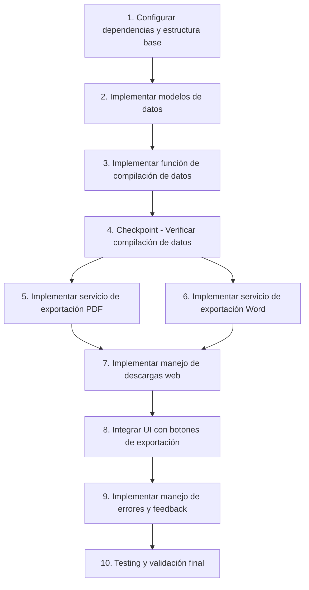

# Implementation Plan: Export Inspection Reports

## Overview

Este plan de implementación detalla los pasos necesarios para agregar funcionalidades de exportación de reportes en formatos PDF y DOCX a la aplicación Flutter de inspecciones técnicas. La implementación se divide en componentes modulares y reutilizables, con énfasis en la separación de responsabilidades y testing incremental.

## Task Dependency Graph

```json
{
  "waves": [
    {
      "name": "Setup & Foundation",
      "tasks": [1, 2]
    },
    {
      "name": "Data Compilation",
      "tasks": [3, 4]
    },
    {
      "name": "Export Services",
      "tasks": [5, 6, 7]
    },
    {
      "name": "Integration & Polish",
      "tasks": [8, 9, 10]
    }
  ]
}
```



## Tasks

- [x] 1. Configurar dependencias y estructura base
  - Verificar que `pubspec.yaml` contiene las dependencias necesarias: `pdf: ^3.12.0`, `printing: ^5.14.3`, `docx_creator: ^1.2.7`
  - Crear archivo `lib/services/pdf_export_service.dart` para la generación de PDFs
  - Crear archivo `lib/services/word_export_service.dart` para la generación de Word
  - Crear archivo `lib/utils/web_download_helper.dart` para manejo de descargas web
  - Crear archivo `lib/models/inspection_data.dart` para modelos de datos
  - Agregar imports condicionales necesarios en los archivos correspondientes
  - _Requirements: 8.1, 8.2, 8.3, 8.4, 8.5, 8.6, 8.7, 8.8, 8.9, 8.10_

- [x] 2. Implementar modelos de datos
  - [x] 2.1 Crear clase `InspectionData` con campos: plazaId, nombrePlaza, correoSupervisor, fechaHora, estadoGeneral, sections
    - Agregar constructor con required fields
    - Agregar validación básica en el constructor
    - _Requirements: 3.1, 6.6_
  
  - [x] 2.2 Crear clase `EvaluationSection` con campos: title, criteria, evaluations
    - Agregar getter `evaluatedItems` que retorna List<EvaluatedItem>
    - Implementar mapeo de criterios a ítems evaluados
    - _Requirements: 3.3, 3.4, 3.5_
  
  - [x] 2.3 Crear clase `EvaluatedItem` con campos: criterio, valor
    - Agregar getter `isProblematic` para identificar items Regular/Malo
    - _Requirements: 3.6_

- [x] 3. Implementar función de compilación de datos
  - [x] 3.1 Crear método `_compilarDatosInspeccion()` en InspeccionTecnicaScreen
    - Recopilar datos de todas las evaluaciones: _evaluacionesAseo, _evaluacionesCesped, _evaluacionesArbolado, _evaluacionesFlores, _evaluacionesCaminos, _evaluacionesInfraestructura
    - Recopilar todas las listas de criterios correspondientes
    - Crear instancia de InspectionData con los 6 sections en orden correcto
    - Usar "N/A" como valor por defecto para evaluaciones ausentes
    - _Requirements: 3.1, 3.2, 3.3, 3.4, 3.5, 3.6_
  
  - [x] 3.2 Implementar función `_calcularEstadoGeneral()` (ya existe, verificar lógica)
    - Contar items evaluados como "Malo"
    - Contar items evaluados como "Regular"
    - Retornar "Malo" si >5 items son "Malo"
    - Retornar "Regular" si >0 items son "Malo" OR >10 items son "Regular"
    - Retornar "Bueno" en cualquier otro caso
    - _Requirements: 3.7, 3.8, 3.9_
  
  - [ ]* 3.3 Write property test for data compilation
    - **Property 1: Complete Section Coverage**
    - **Validates: Requirements 1.1, 2.1, 3.2**
  
  - [ ]* 3.4 Write property test for estado general calculation
    - **Property 4: Valid Estado General Calculation**
    - **Validates: Requirements 3.7, 3.8, 3.9**
  
  - [ ]* 3.5 Write property test for data immutability
    - **Property 5: Evaluation State Preservation**
    - **Validates: Requirements 3.10**

- [x] 4. Checkpoint - Verificar compilación de datos
  - Ensure all tests pass, ask the user if questions arise.

- [x] 5. Implementar servicio de exportación PDF
  - [x] 5.1 Crear clase `PDFExportService` en `lib/services/pdf_export_service.dart`
    - Importar `package:pdf/pdf.dart` y `package:pdf/widgets.dart as pw`
    - Crear método `generateInspectionPDF()` que recibe InspectionData
    - _Requirements: 1.1, 1.2_
  
  - [x] 5.2 Implementar método `_buildHeader()` en PDFExportService
    - Crear pw.Header con título "REPORTE DE INSPECCIÓN TÉCNICA"
    - Agregar pw.Divider con thickness: 2
    - _Requirements: 1.2_
  
  - [x] 5.3 Implementar método `_buildInfoTable()` en PDFExportService
    - Crear pw.Table con dos columnas (flex 1.5 y flex 3)
    - Agregar filas para: ID av, DESCRIPCIÓN, FECHA/HORA, Inspector
    - Aplicar colores de fondo: grey300 para labels, white para valores
    - Formatear fecha/hora como substring(0, 16)
    - _Requirements: 1.3, 4.10, 6.5, 6.6, 6.10_
  
  - [x] 5.4 Implementar método `_buildEvaluationSection()` en PDFExportService
    - Crear header row con título de la sección en bold, background grey300
    - Crear pw.Table con bordes usando TableBorder.all()
    - Agregar dos columnas: "ÍTEM" (flex 3) y "EVALUACIÓN" (flex 1)
    - Iterar sobre todos los criterios de la sección
    - Para cada criterio, crear fila con texto del criterio y valor de evaluación
    - Usar "N/A" para evaluaciones ausentes
    - _Requirements: 1.4, 1.5, 4.1, 4.2, 4.4, 4.5, 4.6, 4.8_
  
  - [x] 5.5 Implementar método `_buildSummary()` en PDFExportService
    - Crear pw.Container con padding y border
    - Aplicar background color grey300
    - Mostrar texto "Estado General: {estadoGeneral}" en bold
    - _Requirements: 1.6, 4.9, 6.7_
  
  - [x] 5.6 Ensamblar documento completo en `generateInspectionPDF()`
    - Crear pw.Document()
    - Agregar pw.MultiPage con pageFormat A4 y margin 32
    - En build: agregar header, SizedBox(20), info table, SizedBox(20)
    - Iterar sobre las 6 secciones en orden y agregar tabla de cada una con SizedBox(15) entre ellas
    - Agregar summary al final
    - Retornar el documento completo
    - _Requirements: 1.1, 1.2, 1.3, 1.4, 1.5, 1.6_

- [x] 6. Implementar servicio de exportación Word
  - [x] 6.1 Crear utilidades de exportación Word en `lib/utils/`
    - Crear `word_export.dart` con exports condicionales
    - Crear `word_export_web.dart` para implementación web
    - Crear `word_export_stub.dart` para plataformas no-web
    - _Requirements: 2.1, 2.13, 8.8, 8.10_
  
  - [x] 6.2 Implementar generación de documento Word en word_export_web.dart
    - Crear función `generateWordDocument()` que recibe InspectionData
    - Agregar header "REPORTE DE INSPECCIÓN TÉCNICA"
    - Agregar tabla de información con plazaId, nombrePlaza, fechaHora, correoSupervisor
    - _Requirements: 2.2, 2.3_
  
  - [x] 6.3 Agregar secciones de evaluación al documento Word
    - Iterar sobre las 6 secciones en orden
    - Para cada sección, agregar header con nombre de la sección
    - Agregar tabla con columnas "ÍTEM" y "EVALUACIÓN"
    - Incluir todos los criterios y valores (usar "N/A" si ausente)
    - _Requirements: 2.4, 4.3, 4.4, 4.5_
  
  - [x] 6.4 Agregar resumen al documento Word
    - Agregar sección de Estado General al final del documento
    - Formatear como texto destacado con el valor calculado
    - Convertir documento a Uint8List usando docx.save()
    - _Requirements: 2.5, 4.9_

- [x] 7. Implementar manejo de descargas web
  - [x] 7.1 Crear utilidades de descarga en `lib/utils/`
    - Crear `download_helper.dart` con exports condicionales
    - Crear `download_helper_web.dart` para manejo de descargas web
    - Importar 'dart:html' condicionalmente
    - _Requirements: 2.6, 8.8_
  
  - [x] 7.2 Implementar función `downloadFile()` en download_helper_web.dart
    - Crear Blob con bytes y MIME type apropiado
    - Crear URL temporal con Url.createObjectUrlFromBlob()
    - Crear AnchorElement con href apuntando a la URL del Blob
    - Configurar atributo download con filename
    - Realizar click programático en el anchor element
    - Limpiar URL temporal con Url.revokeObjectUrl()
    - _Requirements: 2.6, 2.7, 2.8, 2.9, 2.10_
  
  - [x] 7.3 Implementar función `downloadWord()` específica para Word
    - Usar MIME type "application/vnd.openxmlformats-officedocument.wordprocessingml.document"
    - Seguir mismo patrón que downloadFile()
    - _Requirements: 2.6, 6.4_

- [x] 8. Integrar UI con botones de exportación
  - [x] 8.1 Implementar método `_exportarReportePDF()` en InspeccionTecnicaScreen
    - Llamar a `_compilarDatosInspeccion()` para obtener datos
    - Crear instancia de PDFExportService
    - Llamar a `generateInspectionPDF()` con los datos
    - Usar Printing.layoutPdf() para mostrar diálogo de guardado nativo del navegador
    - Usar nombre de archivo formato "Inspeccion_{plazaId}_{timestamp}.pdf"
    - _Requirements: 1.7, 1.8, 6.1, 6.3_
  
  - [x] 8.2 Implementar método `_exportarReporteWord()` en InspeccionTecnicaScreen
    - Verificar plataforma con kIsWeb
    - Si no es web, mostrar error (Requirement 2.13)
    - Llamar a `_compilarDatosInspeccion()` para obtener datos
    - Llamar a `word_export.generateWordDocument()` con los datos
    - Llamar a `downloadWord()` con bytes y filename
    - Usar nombre de archivo formato "Inspeccion_{plazaId}_{timestamp}.docx"
    - _Requirements: 2.1, 2.5, 2.13, 6.2_
  
  - [x] 8.3 Conectar callbacks en PanelAccionesFinales
    - Pasar `_exportarReportePDF` como callback onExportarPDF
    - Pasar `_exportarReporteWord` como callback onExportarWord
    - Verificar que botones existentes funcionan correctamente
    - _Requirements: 7.3, 7.4, 7.5, 7.6, 7.7, 7.8_

- [x] 9. Implementar manejo de errores y feedback
  - [x] 9.1 Agregar try-catch en `_exportarReportePDF()`
    - Capturar cualquier excepción durante generación PDF
    - Mostrar SnackBar verde con éxito (#FF2E7D32) con mensaje "✓ PDF generado exitosamente"
    - Mostrar SnackBar rojo con error en caso de falla
    - Verificar mounted antes de mostrar SnackBar
    - _Requirements: 1.9, 1.10, 5.2, 5.4, 5.6, 5.7_
  
  - [x] 9.2 Agregar try-catch en `_exportarReporteWord()`
    - Capturar cualquier excepción durante generación Word
    - Mostrar SnackBar verde con éxito (#FF2E7D32) con mensaje "✓ Word generado exitosamente"
    - Mostrar SnackBar rojo con error en caso de falla
    - Incluir mensaje específico para plataforma no-web
    - Verificar mounted antes de mostrar SnackBar
    - _Requirements: 2.11, 2.12, 2.13, 5.3, 5.5, 5.9_
  
  - [x] 9.3 Implementar limpieza de recursos
    - Asegurar que Url.revokeObjectUrl() siempre se llame después de descarga
    - No dejar file handles o blob URLs colgando
    - Ejecutar exportaciones de forma asíncrona sin bloquear UI
    - _Requirements: 2.10, 5.1, 5.8, 7.10_

- [x] 10. Testing y validación final
  - [x] 10.1 Prueba manual de exportación PDF
    - Crear inspección de prueba con datos en todas las secciones
    - Verificar que el PDF se genera correctamente
    - Verificar que todas las secciones aparecen en el orden correcto
    - Verificar formato y estructura de tablas
    - Verificar cálculo de Estado General
    - Verificar nombre de archivo y timestamp
    - _Requirements: 1.1-1.10, 4.1-4.10, 6.1-6.10_
  
  - [x] 10.2 Prueba manual de exportación Word
    - Crear inspección de prueba con datos en todas las secciones
    - Verificar que el Word se descarga correctamente en navegador
    - Abrir documento en Microsoft Word o LibreOffice
    - Verificar que el documento es editable
    - Verificar que todas las secciones aparecen correctamente
    - Verificar que no hay logos no deseados inyectados
    - _Requirements: 2.1-2.13, 4.3-4.5_
  
  - [x] 10.3 Pruebas de casos extremos
    - Probar con evaluaciones vacías (todos N/A)
    - Probar con solo algunas secciones completadas
    - Probar con nombres de plaza largos o caracteres especiales
    - Probar con correos electrónicos inválidos
    - Probar en diferentes navegadores (Chrome, Firefox, Safari)
    - _Requirements: 3.6, 3.10, 5.9, 5.10, 6.8_
  
  - [x] 10.4 Validación de requisitos completos
    - Verificar que todos los 8 requisitos principales están implementados
    - Revisar lista de acceptance criteria y confirmar cumplimiento
    - Verificar integración correcta con UI existente
    - Confirmar que no hay regresiones en funcionalidad existente
    - _Requirements: All (1.1-8.10)_

## Notes

### Implementación Completada

La funcionalidad de exportación de reportes en PDF y Word ha sido completamente implementada en el proyecto. Los siguientes componentes están en su lugar:

**Servicios y Utilidades:**
- `lib/services/pdf_export_service.dart` - Generación de PDFs con formato profesional
- `lib/services/word_export_service.dart` - Placeholder para futuras mejoras
- `lib/utils/word_export.dart` - Export condicional para generación Word
- `lib/utils/word_export_web.dart` - Implementación web de generación Word
- `lib/utils/word_export_stub.dart` - Stub para plataformas no-web
- `lib/utils/download_helper.dart` - Export condicional para descargas
- `lib/utils/download_helper_web.dart` - Implementación de descargas web
- `lib/models/inspection_data.dart` - Modelos de datos para inspecciones

**Integración en InspeccionTecnicaScreen:**
- Método `_compilarDatosInspeccion()` - Compila datos de las 6 secciones
- Método `_exportarReportePDF()` - Genera y descarga PDF
- Método `_exportarReporteWord()` - Genera y descarga Word (solo web)
- Callbacks conectados a botones en `PanelAccionesFinales`

**Características Implementadas:**
- ✅ Exportación PDF con formato profesional y tablas estructuradas
- ✅ Exportación Word editable solo en plataforma web
- ✅ Compilación automática de datos de 6 secciones (ASEO, CÉSPED, ARBOLADO, FLORES, CAMINOS, INFRAESTRUCTURA)
- ✅ Cálculo automático de Estado General basado en criterios
- ✅ Manejo de descargas específico para Flutter web
- ✅ Manejo de errores con feedback visual (SnackBars)
- ✅ Nombres de archivo con timestamp único
- ✅ Validación de plataforma para exportación Word

### Pendiente

**Testing Automatizado:**
- Property tests para compilación de datos (Task 3.3)
- Property tests para cálculo de Estado General (Task 3.4)
- Property tests para inmutabilidad de datos (Task 3.5)

Estos tests no son críticos para la funcionalidad pero proporcionarían validación automatizada adicional de la lógica de negocio.

### Consideraciones Técnicas

**Plataforma Web:**
- La exportación Word solo funciona en Flutter web debido al uso de `dart:html`
- Las descargas usan el API de Blob y AnchorElement del navegador
- Los archivos se descargan directamente sin necesidad de path_provider

**PDF vs Word:**
- PDF usa el paquete `printing` que funciona en todas las plataformas
- PDF muestra diálogo nativo de guardado del navegador
- Word genera archivo descargable directamente en el navegador

**Formato de Documentos:**
- Ambos formatos incluyen las mismas 6 secciones en el mismo orden
- Las tablas tienen estructura idéntica (ÍTEM | EVALUACIÓN)
- El Estado General se calcula dinámicamente basado en las evaluaciones

### Referencias

- **Packages Utilizados:**
  - `pdf: ^3.12.0` - Generación de PDFs
  - `printing: ^5.14.3` - Diálogos de impresión/guardado
  - `docx_creator: ^1.2.7` - Generación de documentos Word
  
- **Documentación Relevante:**
  - [pdf package](https://pub.dev/packages/pdf)
  - [printing package](https://pub.dev/packages/printing)
  - [docx_creator package](https://pub.dev/packages/docx_creator)
